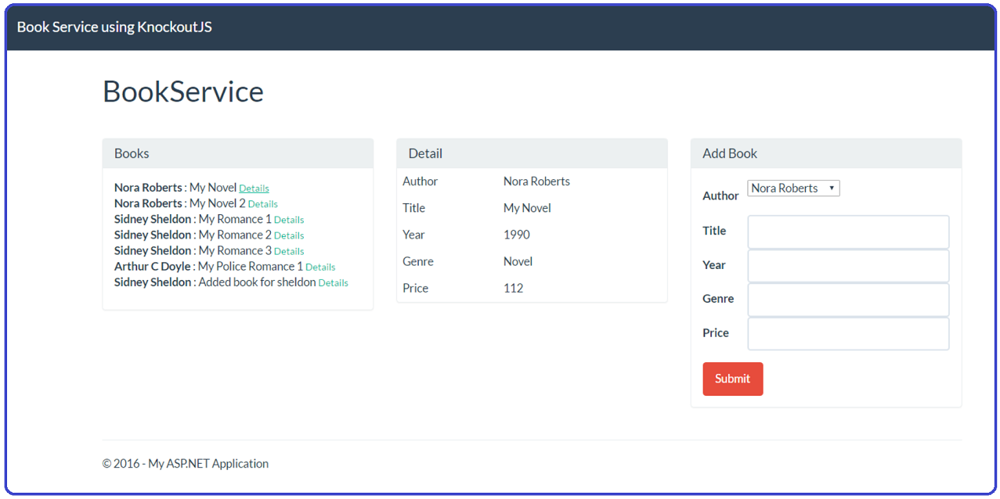

# BookServiceWebAPIKnockoutJS
This tutorial creates a web application with an ASP.NET Web API back end, using Entity Framework 6 for the data layer, and Knockout.js for the client-side JavaScript application.
 My purpose following this tutorial was to explore the integration between KnockoutJS and MVC a bit, and its basic functionalities.
  
Original code at: http://www.asp.net/web-api/overview/data/using-web-api-with-entity-framework/part-1
  

 
The app uses a single-page application (SPA) design. “Single-page application” is the general term for a web application that loads a single HTML page and then updates the page dynamically, instead of loading new pages. After the initial page load, the app talks with the server through AJAX requests. The AJAX requests return JSON data, which the app uses to update the UI.
  
AJAX isn't new, but today there are JavaScript frameworks that make it easier to build and maintain a large sophisticated SPA application. This tutorial uses Knockout.js, but you can use any JavaScript client framework.
  
Here are the main building blocks for this app:
 
<ul>
  <li>ASP.NET MVC creates the HTML page. </li>
  <li>ASP.NET Web API handles the AJAX requests and returns JSON data. </li>
  <li>Knockout.js data-binds the HTML elements to the JSON data. </li>
  <li>Entity Framework talks to the database. </li>
</ul>
